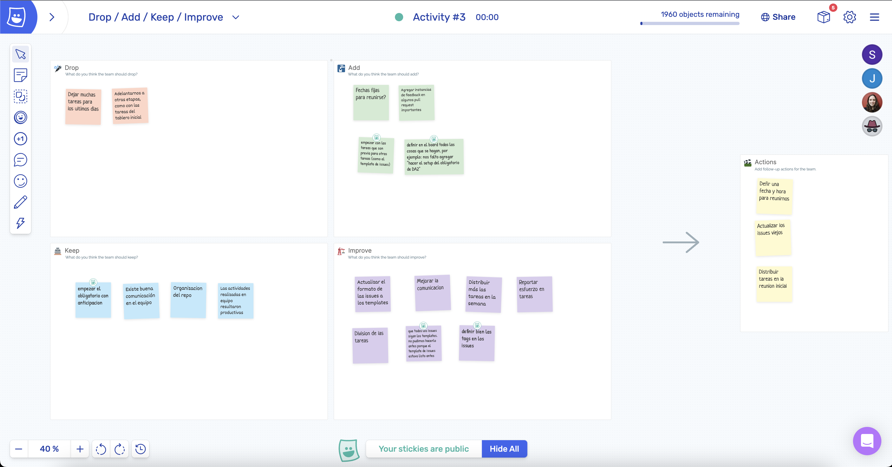

# Retrospectiva

Utilizamos la herramienta "metroretro" siguiento el método DAKI (drop, add, keep, improve). 

Los temas más recurrentes fueron la organización/división de las tareas y el uso tardío de los templates de los issues. 
Consideramos que empezamos el obligatorio con anticipación pero que luego algunas tareas nos quedaron para el final, y se comentó que por momentos no era tan clara la asignación de las mismas. Además, fue un poco difícil coordinar las reuniones debido a diferencias horarias y vacaciones.
Se destacó la buena comunicación y la productividad del equipo en las reuniones a lo largo de la entrega.

A partir de los problemas identificados, concluimos los siguientes action items:
- Distribuir tareas en la reunion inicial
- Defir una fecha y hora para reunirnos
- Actualizar los issues viejos

**Link al video**: https://youtu.be/t4Czo73OMgI

Screenshot de metroretro:

