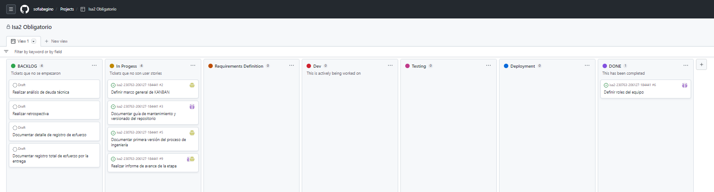
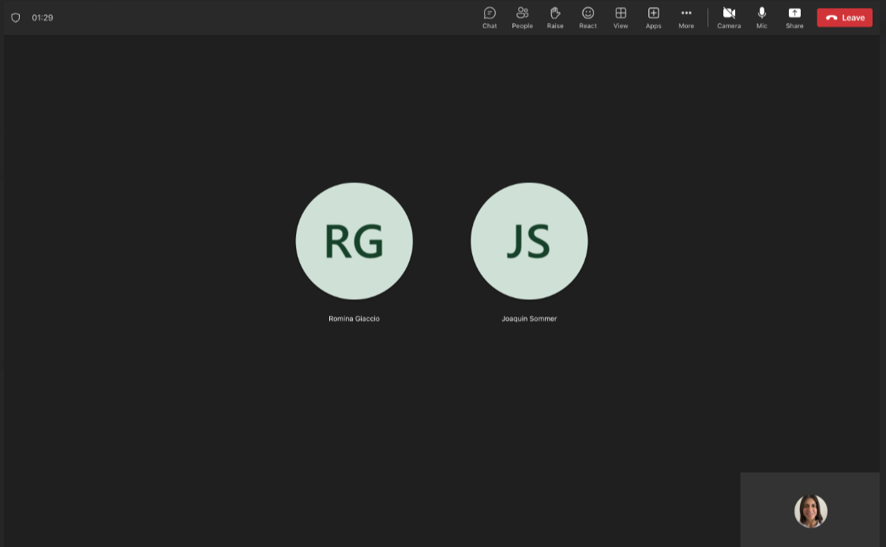
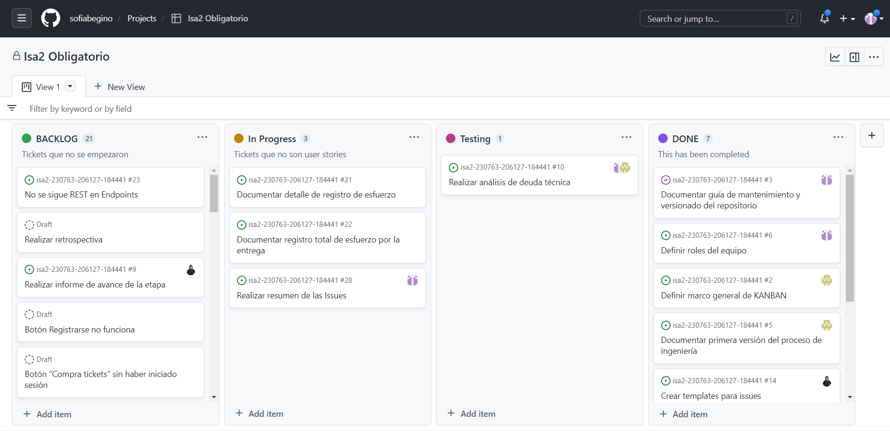
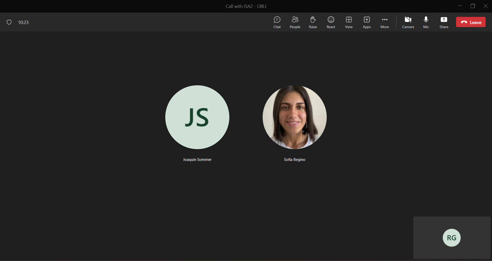

# Stand-up 

Se realizo una kick-off el día 3 de abril en el cual se decidió hacer stand-up semanales y se definio un tablero inicial para el proyecto.
Nos reunimos el 4 de abril y el 11 de abril, donde compartimos el tablero y cada miembro del equipo pudo comunicar su progreso en las tareas que le fueron asignadas e identificar cualquier obstáculo encontrado.

Minuta reunión 4 de Abril:

Durante esta Standup cada integrante del equipo comento sobre las tareas que estaba realizando, se revisaron las mismas y se agregaron algunas nuevas issues al tablero.

Minuta reunión 11 de Abril:

En esta instancia cada integrante del equipo comento las tareas realizadas y las que estaban pendientes, se agregaron nuevas issues como las referidas a los templates para las issues de bugs y sobre la realización de un resumen de las issues. 