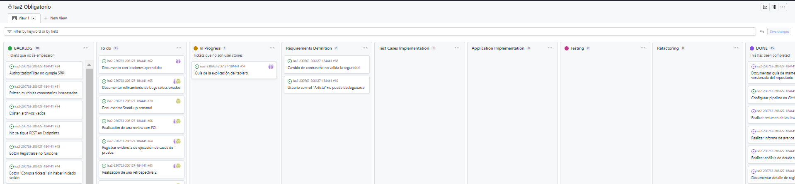

# Modificaciónes al Proceso de ingeniería

Realizamos algunas adaptaciones respecto al proceso de ingeniería presentado en la primera entrega. Debido a que en esta entrega se deben trabajar dos bugs.
Teniendo en cuenta que los roles que se manejan en este proyecto son: tester (los mismos también participan como programadores), integrante que actúa como PO e integrante que actúa como SM, el nuevo proceso de ingeniería es:

1) Requirements Definition
* Cómo: Utilizando template de User story
* Cuándo: Al iniciar el proceso de reparación de bugs.
* Quién: Testers/Programadores/PO
2) Test Cases Implementation
* Cómo: Se implementan tests.
* Cuándo: Luego de generar las User story correspondientes.
* Quién: Testers/Programadores
3) Application Implementation
* Cómo: Se trabaja en el código de la aplicación.
* Cuándo: Luego de la implementacion de los casos de prueba correspondientes.
* Quién: Testers/Programadores
4) Testing
* Cómo: Ejecucion de casos de prueba implementadoa en el paso 2.
* Cuándo: Luego de finalizada la implementación de los ajustes.
* Quién: Testers
5) Refactor
* Cómo: Mejorar el código.
* Cuándo: Luego de realizado el testing, si existe algun ajuste o mejora a realizar.
* Quién: Testers/Programadores

# Modificaciónes del tablero

Para esta instancia se agregaron nuevas columnas para con la estratégia BDD, estas son las siguientes:

* Requirements Definition - En esta intancia se utilizara para refinar los requerimientos de los bugs a solucionar y pasarlos a User Story
* Test Cases Implementation - En esta intancia se utilizara para implementar los test que luego serviran para implementar la solucion
* Application Implementation - En esta instancia se desarrolla el codigo para solucionar el bug
* Refactor - Luego de ejecutar los tests y probar la solucion de los bugs se decidirá si es necesario realizar algun ajuste, en dicho caso la issue se moverá hasta esta columna.

Por otro lado, además agregamos una nueva columna "TO DO" que se ocupara para ubicar las issues que se van a estar trabajando del BACKLOG, ya que para esta entrega solo se van a trabajar 2 bugs y nuestro BACKLOG cuenta con muchos más.

Finalmente, la columna de "IN PROGRESS" se utilizará para ubicar las issues de documentación que se están trabajando y que luego pasarán a estar en "DONE", ya que no pasan por todas las instancias del proceso como si lo podrían hacer los bugs.

# Guía del tablero

Existen dos flujos de las issues por el tablero:

## Issues relacionadas a la documentación

Nacen en la columna BACKLOG, luego en la entrega que corresponde se mueven a la columna de TO DO, desde allí se van tomando para trabajarce y se van moviendo a IN PROGRESS, finalmente cuando se termina de trabajar en estas se mueven a la columna DONE, terminando el recorrido por el tablero.

## Issues de bugs

Nacen en la columna BACKLOG, luego en la entrega que corresponde se mueven a la columna de TO DO, desde allí se van tomando para trabajarce y se puede mover a "Requirements Definition", cuando se termina de procesar, se pasan a la columna "Test Cases Implementation", luego pasan por la columna de "Application Implementation", pasando luego por "testing" y "Refactoring" de ser necesario, terminando el recorrido por el tablero en la columna DONE.

Tener en cuenta de que no todas las issues son bugs, es por esto que pueden existir ligeras variantes.

