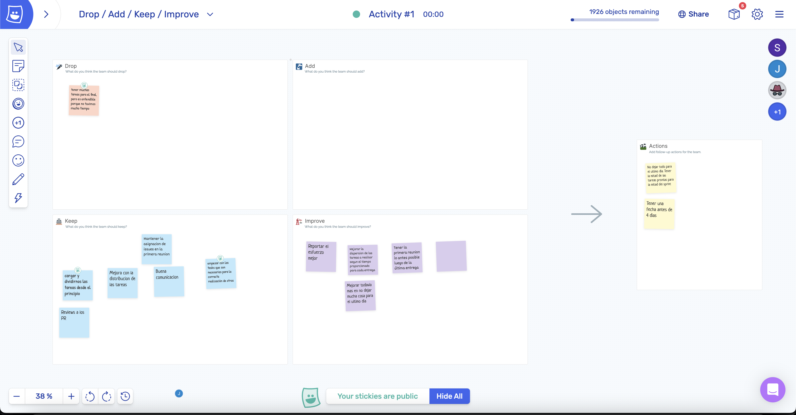

# Retrospectiva

Utilizamos la herramienta "metroretro" siguiento el método DAKI (drop, add, keep, improve). 

Los temas principales fueron:
- debemos seguir asignando las tareas desde el principio
- debemos mejorar/dejar de acumular muchas tareas al final

A partir de los problemas identificados, concluimos los siguientes Action Items:
- No dejar todo para el ultimo dia. Tener la mitad de las tareas prontas para la mitad del sprint
- Tener una fecha de próxima reunión menor a 4 dias

**Link al video**: https://youtu.be/gpGnz78QDd4

Screenshot de metroretro:

