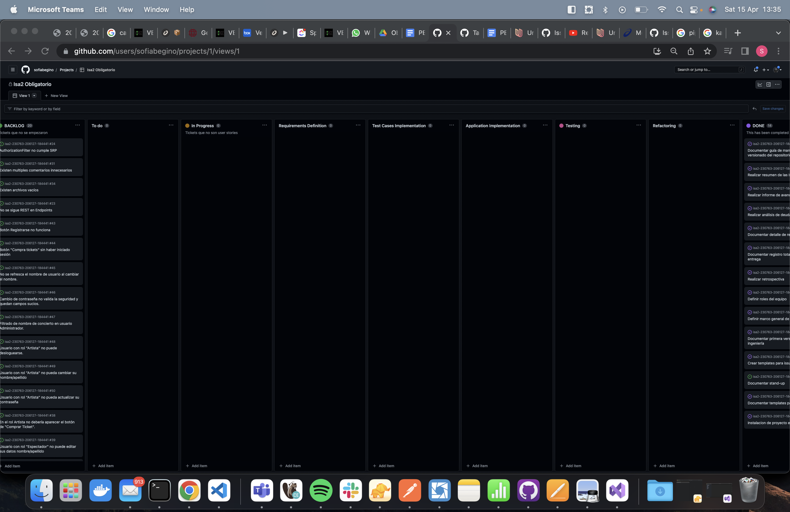

# Stand-up

El 15/4 tuvimos la stand-up de la entrega 2. En este caso se tomo esta reunion como la incial de la segunda entrega ya que esta solo duraba 1 semana.

Como era la primera reunion lo que se hizo fue ver que tareas habia que hacer y dividir las tareas entre los integrantes del grupo. 

Se entiende que el objectivo de la standup es discutir las tareas en curso y los problemas que se puedan presentar. Debido a la corta duracion de la entrega se decidio que los problemas los ibamos a discutir por el chat del grupo. En las proximas entregas se va a tratar de hacer la standup de la manera correcta.

Foto de la reunión

Tablero al finalizar la reunion

