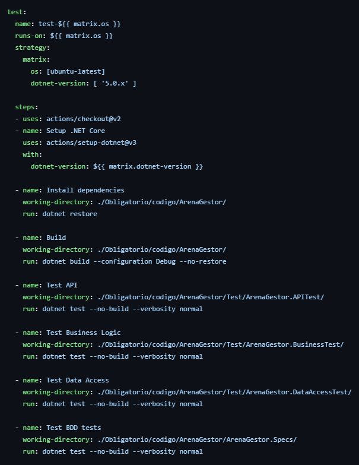
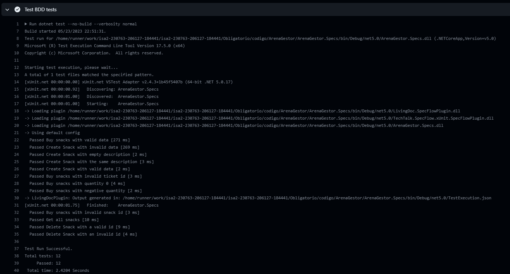

# Actualizacion del pipeline

En esta entrega se tuvo que actualizar el pipeline en github actions para que corra los tests que se agregaron haciendo BDD. Se agrego el directorio nuevo que se creo para los tests con BDD y se modifico el archivo de github actions para que corra los tests de BDD. En la siguiente imagen se encuentra el cambio que se hizo en el archivo de github actions. Se agrego `Tests BDD tests`

En la siguiente imagen se encuentra el resultado de correr el pipeline. Se puede ver que corrio los tests de BDD y que todos pasaron.

