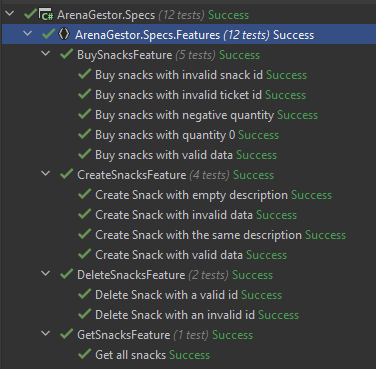
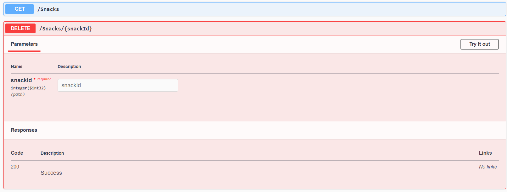
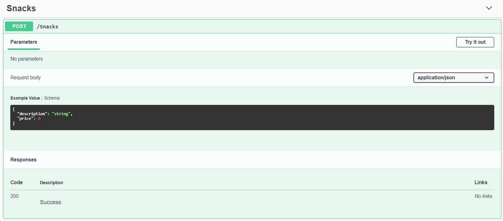
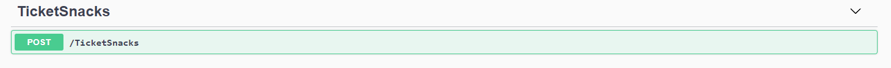

# Evidencia de pruebas

En la siguiente imagen se puede apreciar la evidencia de las pruebas ejecutadas para los endpoints implementados:

* Get - snacks (Obtener todos los snacks)
* Post - snacks (Alta de snacks)
* Post - TicketCompra (Agregar snacks a compra)
* Delete - snacks (Baja de snacks)

También en las siguientes capturas de Swager se pueden ver los nuevos endpoints generados:

