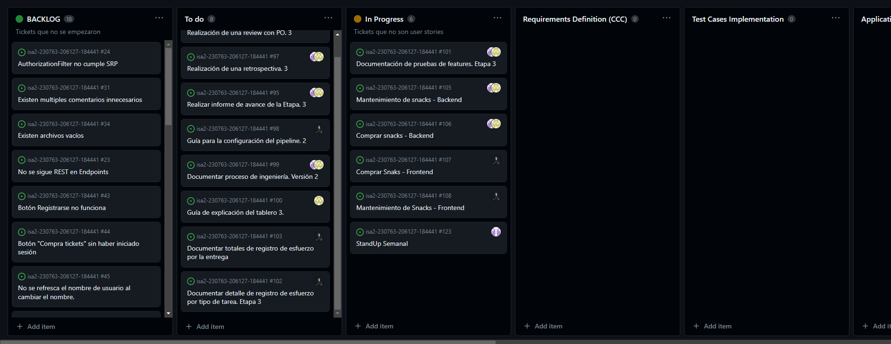

# Modificaciónes al Proceso de ingeniería

En esta entrega se modificó el proceso de ingeniería para poder trabajar con la estrategia BDD, la cual consiste en que primero se definen los requerimientos y luego se implementan los tests, para luego implementar la solución. Esto se debe a que en la entrega anterior se trabajó con la estrategia TDD, la cual consiste en que primero se implementan los tests y luego se implementa la solución.
Teniendo en cuenta que los roles que se manejan en este proyecto son: tester, developer, integrante que actúa como PO e integrante que actúa como SM, el nuevo proceso de ingeniería es:

1) Requirements Definition
* Cómo: Utilizando template de User story
* Cuándo: Cuando se piensa en una nueva funcionalidad o se identifica un bug.
* Quién: PO
1) Test Cases Implementation
* Cómo: Se crean los escenarios de prueba para la User story correspondiente utilizando BDD.
* Cuándo: Luego de generar las User story correspondientes.
* Quién: Developers
1) Application Implementation
* Cómo: Se trabaja en el código de la aplicación.
* Cuándo: Luego de la implementacion de los casos de prueba correspondientes.
* Quién: Developers
1) Testing
* Cómo: Se terminan de implementar los tests de los escenarios de prueba y se ejecutan.
* Cuándo: Luego de finalizada la implementación de las funcionalidades.
* Quién: Developers, Testers
1) Refactor
* Cómo: Mejorar el código.
* Cuándo: Luego de realizado el testing, si existe algun ajuste o mejora a realizar.
* Quién: Developers

# Modificaciónes del tablero

Para esta instancia se agregaron nuevas columnas para con la estratégia BDD, estas son las siguientes:

* Requirements Definition - En esta intancia se utilizara para refinar los requerimientos de los bugs o funcionalidades y pasarlos a User Story
* Test Cases Implementation - En esta intancia se utilizara para implementar los escenarios de prueba de las User Story utilizando BDD
* Application Implementation - En esta instancia se desarrolla el codigo para solucionar el bug o implementar la funcionalidad
* Refactor - Luego de ejecutar los tests y probar la solucion de los bugs se decidirá si es necesario realizar algun ajuste, en dicho caso la issue se moverá hasta esta columna.

Por otro lado, agregamos una nueva columna "TO DO" que se ocupara para ubicar las issues que se van a estar trabajando del "BACKLOG".

Aclaramos además que la columna "Testing" de la entrega 1 se utilizaba para la instancia de identificar bugs/problemas de codigo, pero en esta oportunidad se utiliza como la columna "Testing" de kanban.

Finalmente, la columna de "IN PROGRESS" se utilizará para ubicar las issues de documentación que se están trabajando y que luego pasarán a estar en "DONE", ya que no pasan por todas las instancias del proceso como si lo podrían hacer los bugs.

# Guía del tablero

Existen dos flujos de las issues por el tablero:

## Issues relacionadas a la documentación

Nacen en la columna BACKLOG, luego en la entrega que corresponde se mueven a la columna de TO DO, desde allí se van tomando para trabajarce y se van moviendo a IN PROGRESS, finalmente cuando se termina de trabajar en estas se mueven a la columna DONE, terminando el recorrido por el tablero.

## Issues de bugs o funcionalidades

Nacen en la columna BACKLOG, luego en la entrega que corresponde se mueven a la columna de TO DO, desde allí se van tomando para trabajarce y se puede mover a "Requirements Definition", cuando se termina de procesar, se pasan a la columna "Test Cases Implementation", luego pasan por la columna de "Application Implementation", pasando luego por "testing" y "Refactoring" de ser necesario, terminando el recorrido por el tablero en la columna DONE.

