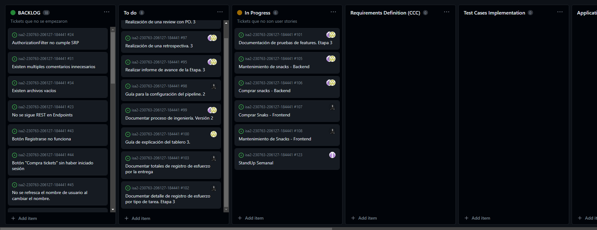
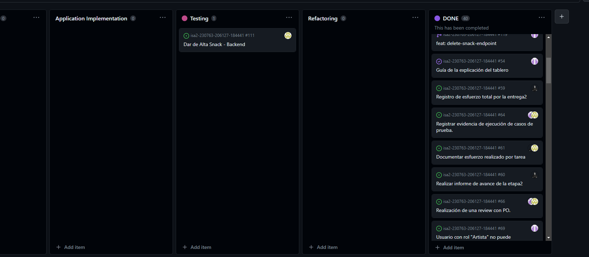

# Proceso de Ingeniería

Nuestro proceso de ingeniería para esta entrega se detalla en la siguiente tabla:

| Que | Quien | Como | Output |
| ------------- | ------------- | ------------- | ------------- |
| Requirement Definition (CCC)  | Todo el equipo | User Stories | To do (product backlog) |
| Test Cases Implementation | Desarrolladores | Código Gherkin | Escenarios de prueba base para la automatización de pruebas |
| Application Implementation | Desarrolladores  | POO + C# | Código de las features implementado |
| Testing | Testers | Specflow  (Test automatizados)| Código y bugs detectados |
| Refactoring | Desarrolladores | POO + C# | Código mejorado |

1) Requirements Definition
* Cómo: Utilizando template de User story
* Cuándo: Al iniciar el proceso de preparación de bugs.
* Quién: PO
2) Test Cases Implementation
* Cómo: Se implementan tests.
* Cuándo: Luego de generar las User story correspondientes.
* Quién: Developers
3) Application Implementation
* Cómo: Se trabaja en el código de la aplicación.
* Cuándo: Luego de la implementacion de los casos de prueba correspondientes.
* Quién: Developers
4) Testing
* Cómo: Ejecucion de casos de prueba implementadoa en el paso 2.
* Cuándo: Luego de finalizada la implementación de los ajustes.
* Quién: Testers
5) Refactor
* Cómo: Mejorar el código.
* Cuándo: Luego de realizado el testing, si existe algun ajuste o mejora a realizar.
* Quién: Developers

# Modificaciónes del tablero

El tablero permanece igual al tablero de la entrega anterior a excepción de: 

* Test Cases Implementation - En esta intancia se utilizara para implementar los escenarios de prueba de las User Story utilizando BDD

