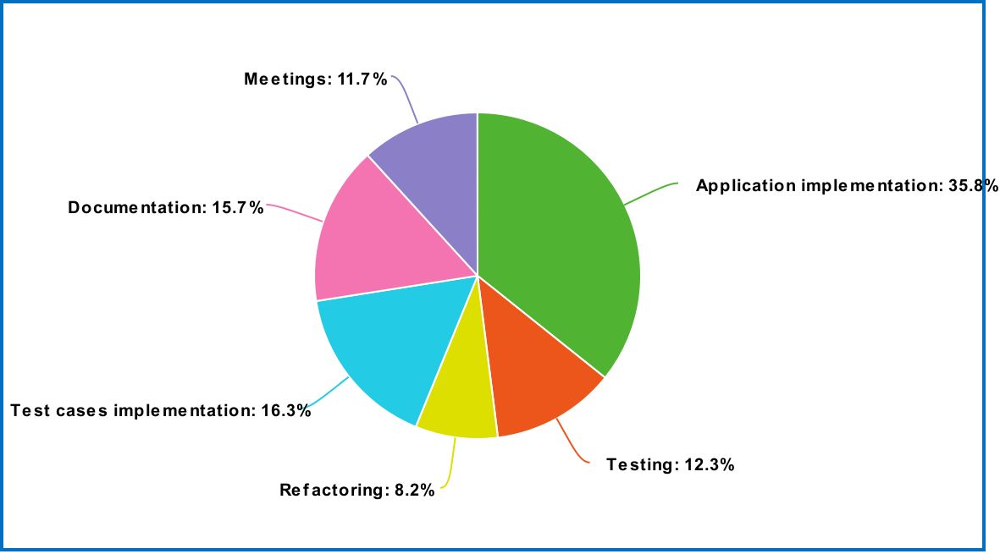

# Registro de Esfuerzo

A continuacion se detallan las tareas realizadas, asi como el esfuerzo estimado y el esfuerzo real de cada una de ellas.

| Tarea | Esfuerzo Estimado | Esfuerzo Real |
|-------|-------------------|---------------|
| Stand Up | 0.75 horas-persona | 0.75 horas-persona | 
| Reunión inicial | 2 horas-persona | 3 horas-persona | 
| Documentar proceso de ingeniería. Versión 2 | 1 h-p  | 1 h-p  |
| Guía de explicación del tablero 3. | 1 h-p  | 1 h-p  | 
| Mantenimiento de snacks - Frontend (Application implementation)  | 3 h-p  | 4 h-p  | 
| Mantenimiento de snacks - Frontend (Testing)  | 1 h-p  | 1 h-p  | 
| Mantenimiento de snacks - Frontend (Refactoring)  | 0.5 h-p  | 0.5 h-p  | 
| Comprar Snaks - Frontend (Application implementation)  | 2 h-p  | 2.5 h-p  |
| Comprar Snaks - Frontend (Testing)  | 1 h-p  | 1.5 h-p  |
| Comprar Snaks - Frontend (Refactoring) | 0.5 h-p  | 1 h-p  |
| Dar de Alta Snack - Backend (Test cases implementation) | 1 h-p  | 1.5 h-p  | 
| Dar de Alta Snack - Backend (Application implementation)  | 2 h-p  | 3 h-p  |
| Dar de Alta Snack - Backend (Testing)  | 1 h-p  | 1 h-p  |
| Dar de Alta Snack - Backend (Refactoring) | 0.5 h-p  | 1 h-p  |
| Dar de Baja Snack - Backend (Test cases implementation) | 0.5 h-p  | 0.5 h-p  | 
| Dar de Baja Snack - Backend (Application implementation)  | 1 h-p  | 2 h-p  |
| Dar de Baja Snack - Backend (Testing)  | 0.5 h-p  | 0.5 h-p  |
| Dar de Baja Snack - Backend (Refactoring) | 0.5 h-p  | 0.5 h-p  |
| Obtener snacks para comprar - Backend (Test cases implementation) | 0.5 h-p  | 0.5 h-p  | 
| Obtener snacks para comprar - Backend (Application implementation)  | 1 h-p  | 1 h-p  |
| Obtener snacks para comprar - Backend (Testing)  | 1 h-p  | 1 h-p  |
| Obtener snacks para comprar - Backend (Refactoring) | 0.5 h-p  | 0.5 h-p  |
| Crear compra de snacks - Backend (Test cases implementation) | 1 h-p  | 1 h-p  | 
| Crear compra de snacks - Backend (Application implementation)  | 3 h-p  | 5 h-p  |
| Crear compra de snacks - Backend (Testing)  | 1 h-p  | 1 h-p  |
| Crear compra de snacks - Backend (Refactoring) | 0.5 h-p  | 0.5 h-p  |
| Documentar detalle de registro de esfuerzo por tipo de tarea. Etapa 3 | 1.5 h-p  | 2 h-p  |
| Documentar totales de registro de esfuerzo por la entrega | 1 h-p  | 1 h-p  |
| Realizar informe de avance de la Etapa. 3 | 1 h-p  | 1 h-p  |
| Realización y documentacioón de una review con PO. 3 | 1.5 h-p  | 1.5 h-p  | 
| Realización y documentación de una retrospectiva. 3 | 1 h-p   | 1.5 h-p   | 
| Documentar lecciones aprendidas | 1 h-p  | 0.7 h-p  | 

El esfuerzo real total de la iteración fue de 44hs y 30minutos aproximadamente.

Detalle de esfuerzo por tipo de tarea:

