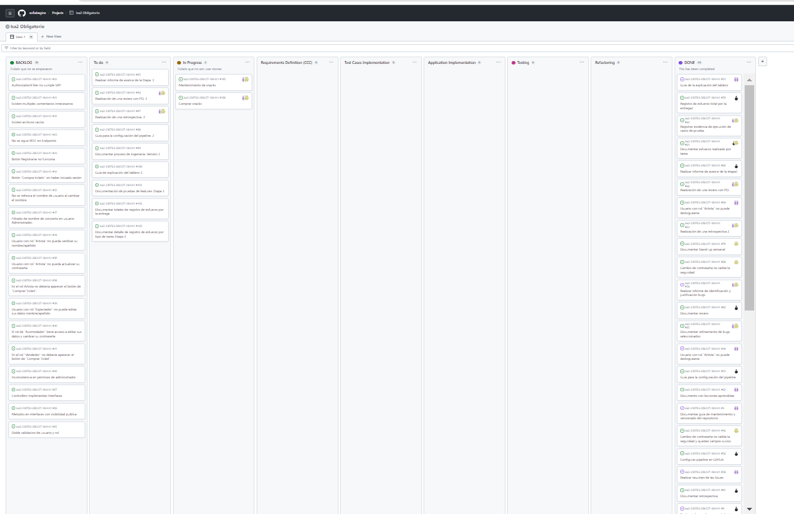
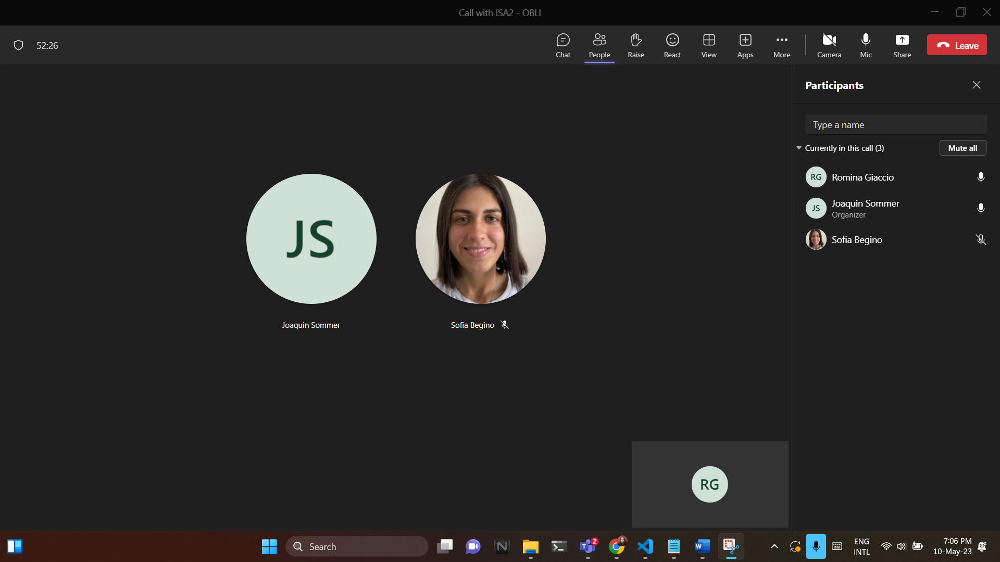
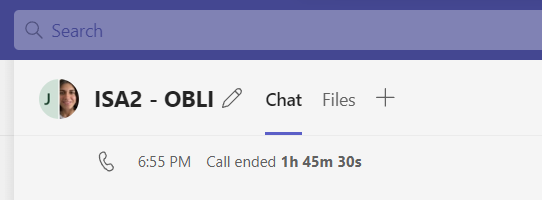

# Stand-up

El 5/05 nos comunicamos para organiazar los siguientes pasos, debido a que no pudimos realizar una Stand-up previa, por motivos de tiempos y que inicialmente consideramos esperar a tener la letra de las features para comenzar a organizarnos, y si bien tuvios charlas casuales y fuimos cargando las issues de documentacion en el tablero, no pudimos realizar una stand-up durante esa semana. En este caso estuvimos armando las issues del tablero, dividiendonos las tareas a realizar. 

El 10/05 tuvimos la stand-up de la entrega 3. Hablamos de las diferentes dificultades que se presentaron los días anteriores, asociados con temas de tiempo y la dificultad de la nueva tecnologia a la que nos estabamos enfrentendo SpecFlow. Se dio una nueva división de trabajos y nos mantuvimos en contacto pero de una manera más informal. 

La última stand-up la realizamos el día 12/05, para organizar que tareas nos quedaban pendientes y como ibamos a enfrentarlas. Una de las dificultades mas grandes que notamos fue la union de nuestras tareas de frontend con nuestras tareas de backend. 

