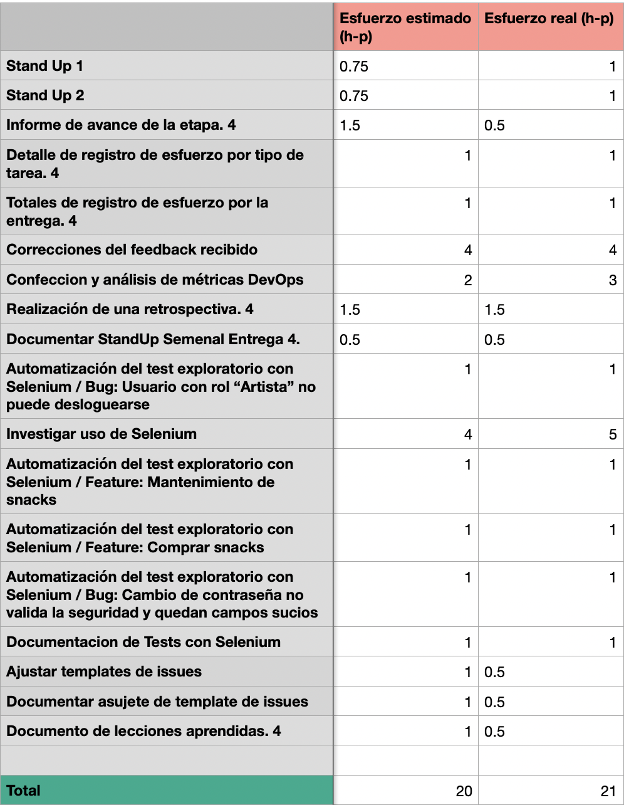
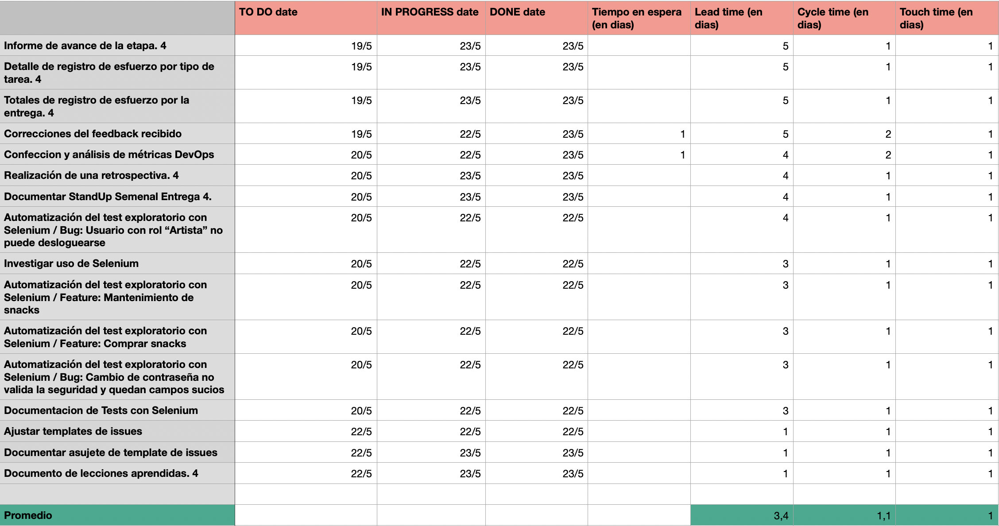
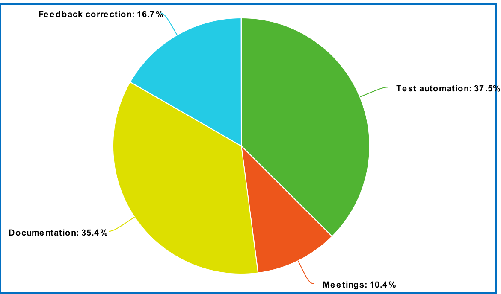

## Métricas

Calculamos las métricas de Kanban: cycle team, lead time, touch time y registro de esfuerzos. También detallamos los esfuerzos por tipo de tarea. A continuación adjuntamos las imagenes correspondientes:

Esfuerzos en horas-persona:

Lead, Cycle and Touch time en días:

Esfuerzos por tarea:

