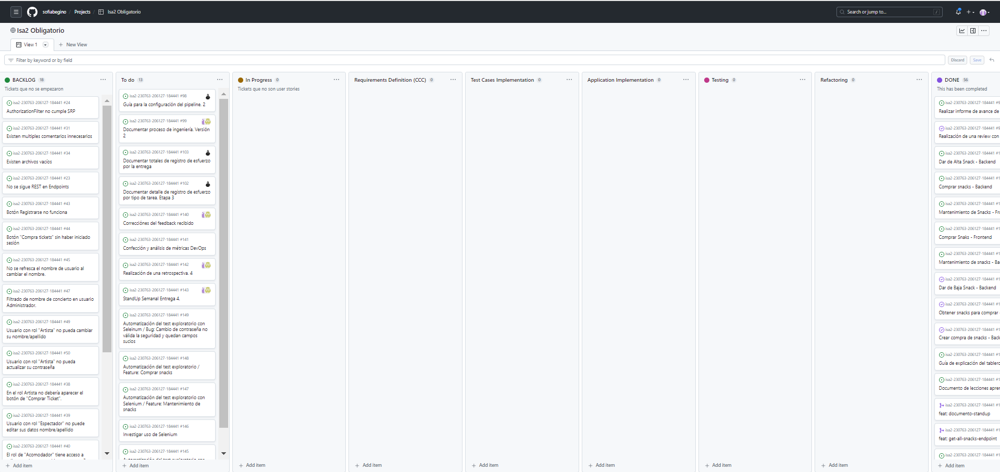
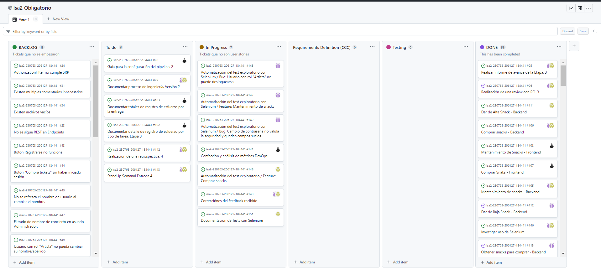

# Proceso de Ingeniería

Nuestro proceso de ingeniería para esta entrega se detalla en la siguiente tabla:

| Que | Quien | Como | Output |
| ------------- | ------------- | ------------- | ------------- |
| Requirement Definition (CCC)  | Todo el equipo | User Stories | To do (product backlog) |
| Testing | Testers | Selenium (Test funcional)| Código y bugs detectados |

# Tablero

Para esta entrega el tablero consta de las columnas segun indica el proceso de ingenieria y las columnas del proceso de Gestión. Las mismas se pueden ver en el tablero modificado:

Tablero 4 inicial:

Tablero 4 modificado y en progreso:

