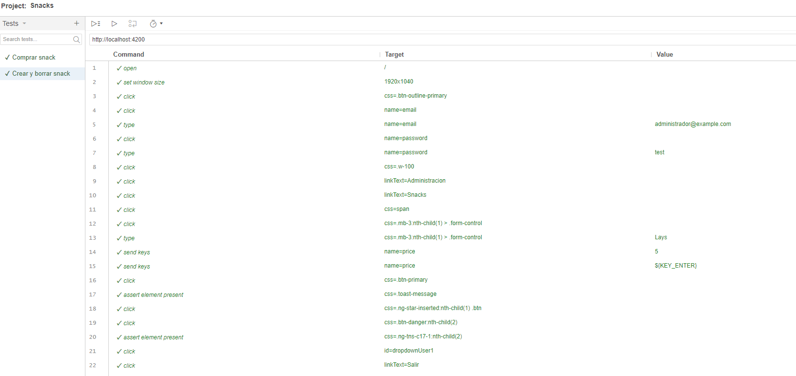
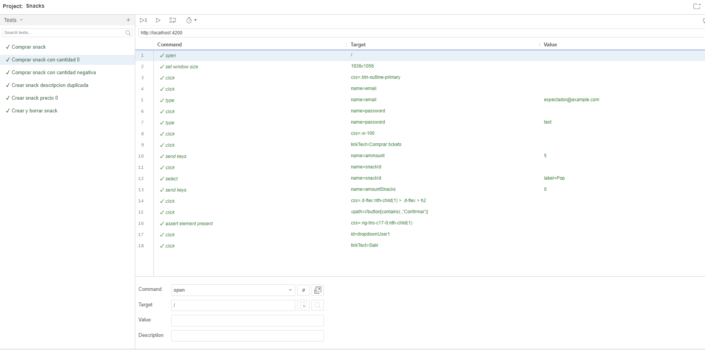

# Selenium Tests

Para la tests funcionales se utilizó Selenium, una herramienta que permite automatizar las pruebas de una aplicación web. Mas concretamente se utilizo Selenium IDE, una extensión de Chrome que permite grabar las acciones que se realizan en el navegador y luego reproducirlas. Luego de grabar las acciones basicas se agregaron asserts para verificar que el sistema se comportara como se esperaba. 

En la [carpeta de selenium proyectos](./SeleniumProyectos) se encuentran los proyectos de Selenium IDE que se utilizaron para realizar los tests. Link a la carpeta:

## Tests de funcionalidades nuevas

Todos los tests parten de un estado donde no hay un usuario logueado. Se intento utilizar un if para desloguear al usuario en caso de que este logueado, pero no se pudo hacer funcionar porque el if de Selenium IDE no funciona correctamente cuando se utiliza !{StatusOK}.

### Test 1: Comprar un snack

Se hizo un assert al popup que aparece cuando se crea un snack para verificar que se creo correctamente.

### Test 2: Crear y borrar un snack

En este caso se hizo un test de dos funcionalidades para que se pueda crear un snack siempre con el mismo nombre y despues borrarlo. Se hizo un assert al popup que aparece cuando se borra un snack para verificar que se borro correctamente y al crear un snack para verificar que se creo correctamente.

### Test 3: Comprar snacks con cantidad 0

### Test 4: Comprar con cantidad negativa

### Test 5: Crear snack con descripcion duplicada

### Test 6: Crear snack con precio 0

## Test de bugs de entrega 2

### Test 145: Bug: Usuario con rol "Artista" no puede desloguearse.

Se intento desloguear al usuario con rol "Artista" y se hizo un assert al popup que aparece cuando se desloguea un usuario para verificar que se deslogueo correctamente.

Tambien se intento probar la persistencia del usuario logeado pero una vez que se cierra la ventana de Chrome se pierde la sesion y no se puede seguir con el test.

### Test 149: Cambio de contraseña

Se testeo el cambio de contraseña de un usuario. Se hizo un assert al popup que aparece cuando se cambia la contraseña de un usuario para verificar que se cambio correctamente. Tambien se probaron 2 casos de error: cuando se ingresa una contraseña incorrecta con solo numeros y cuando no coinciden las contraseñas nuevas.

