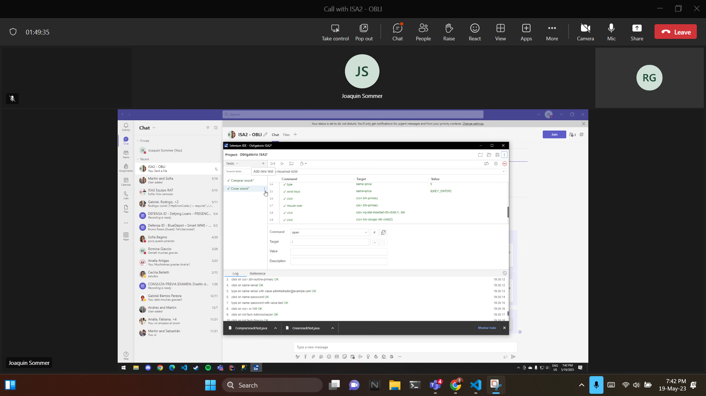
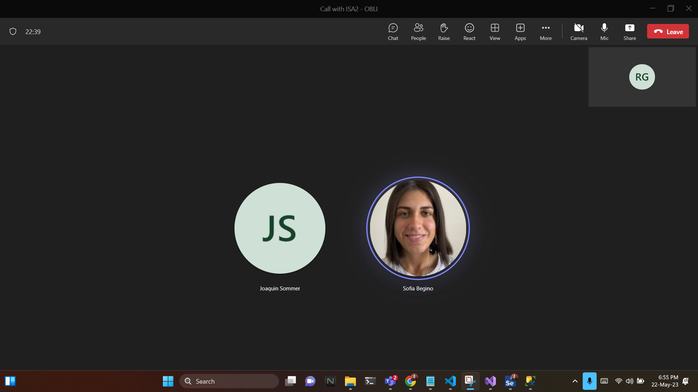

# Stand-up

En esta entrega hicimos dos standups.  

## 19/05

La primera fue el 19/5. En esta standup discutimos las tareas que teniamos pendientes y como las ibamos a encarar. Tambien discutimos como era que ibamos a utilizar Selenium IDE para realizar los tests funcionales. Despues de la standup nos dividimos las tareas.

## 22/05

La segunda standup fue el 22/5. En esta standup compratimos los tests que habiamos hecho y discutimos como abordar algunos problemas que habiamos tenido. Como por ejemplo teniamos un problema que al ingresar un valor numerico, Selenium no lo agregaba. Tambien discutimos como algunos tickets de documentacion sobre que agregar o mejorar utilizando el feedback que nos habian entregado. 

En esta entrega se nos olvido de sacar fotos del tablero en cada standup.

